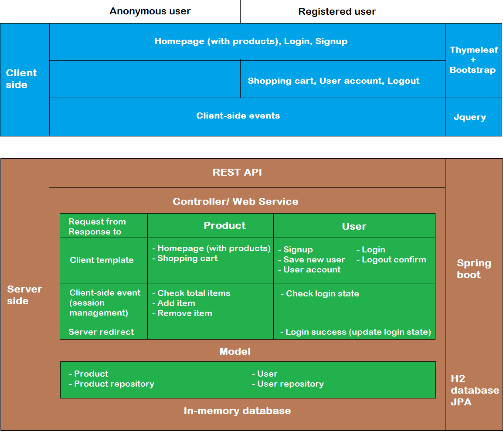

## Introduction 
E-commerce_simple is a simple e-commerce website selling electronics devices. This is the final project for course Server Programming at Haaga-Helia UAS.

For live demo, please visit: https://lamngo-ecommerce-simple.herokuapp.com/

(it might take a while for Heroku Dynos to wake up)

## Software Design

## Technology and Key Features  

### Technology 
- Java Spring
- H2 in-memory database
- JPA
- Thymeleaf template
- Bootstrap
- Jquery
- Cloud hosting on Heroku

### Key Features
- Anonymous user:
  - Access to Home page, Login, Signup
  - View all products
  - Add products to shopping cart
  
- Registered user:
  - Access to all page and function, including shopping cart
  - Remove products in shopping cart
  - View user account info
  - Logout and get shopping cart reset
  
## Further Extension
As a simple version, this project will be extended to more features. The extended version will be update soon.